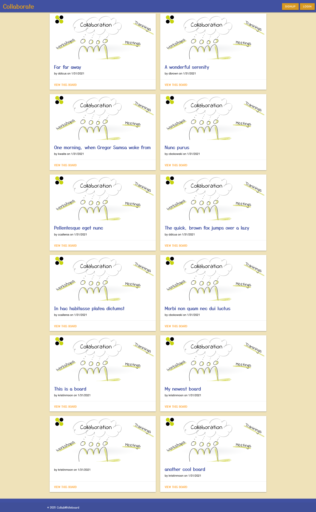
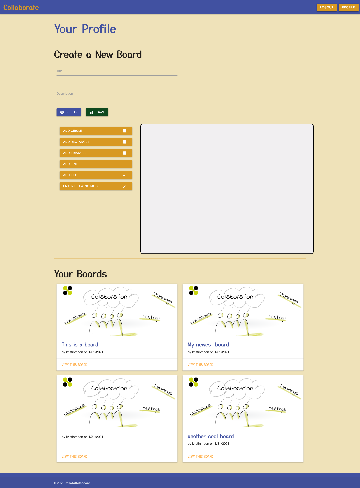

# Collaborate

## Description
A collaborative whiteboard for sharing ideas: Whether you're creating a MMORPG or designing an event, this is the place to share and develop your ideas with collaborators.

## Deployment
Collaborate is published via Heroku at: https://afternoon-stream-77547.herokuapp.com/

Get a feel for the application in the below screenshots...

## Technologies Used
* express
* handlebars
* express-handlebars
* materialize
* bcrypt
* sequelize
* mysql2
* express-session
* fabric

## Example of .env file that will be needed
DB_NAME='collaborative_whiteboard_db'
DB_USER=
DB_PW=

SEQUELIZE_STORE=

## Authors
* Kristin Moon
* Tylor Paggi
* Joe Riley

<!-- # Userstory
## As a user
* When I log onto the site I am presented with a page that allows me to login or sign up
* And in the body I can see public whiteboards

## As a user
* When I click on a public board I am taken to the page that contains that board
* And there is a comment section

## As a user
* When I am creating a whiteboard there is a canvase for me to draw on
* And there is a place for a title
* And there is a place for a description
* And I am forced to put in some keywords that can be used for searching
* And there is a place to choose if this is public or private
* And there are all kinds of bells and whistles that Tylor and Kristin like and go ooohhh and ahhh over
* And I am able to save the board

## As a user who has an account
* When I log on I am taken to a dashboard page that has all of my boards onit.

## As a user who already has a board saved I am able to open one of my old boards
* And edit it

# _pie in the sky hopes_
## As a user who has access to another users board I am able to see their changes in real time
* And I am able to make changes to their board in real time (using socketIO)

## As a visitor to the site I am able to search for keywords
* And have public boards that match those keywords render

## As a user I am able to upload an image to my board

## As a user I am able to download my board

## As a user I can get a link to my board to send it out to fellow collaborators

## As a user I am able to use urls to add images to the board. -->
